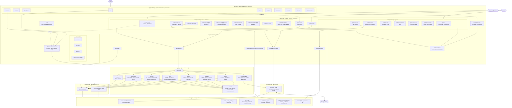

# Site structure

How the public site, member portal, API routes, workspace packages, and database fit together. GitHub renders the diagram below.

```mermaid
flowchart TB
  %% Buzz (SASE at Georgia Tech) - site structure

  visitor([Visitor])
  member([Member])
  admin([Admin / Super admin])
  google[[Google OAuth]]

  subgraph web["sites/web - @buzz/web (Next.js 16, Vercel)"]
    direction TB

    subgraph marketing["app/(marketing) - public, prerendered, no session"]
      home["/"]
      about["/about"]
      programs["/programs"]
      mevents["/events"]
      join["/join"]
      board["/board"]
      sponsors["/sponsors"]
      contact["/contact"]
      discord["/discord"]
      webteam["/website-team"]
    end

    subgraph meta["SEO / meta"]
      robots["robots.ts"]
      sitemap["sitemap.ts"]
      manifest["manifest.ts"]
      og["opengraph-image.tsx"]
    end

    calcache["data/chapter-events.ts<br/>unstable_cache calendar query"]
    sitecomp["components/site<br/>nav, footer, hive, blocks"]
    ui["components/ui<br/>Watermelon UI primitives"]
    staticdata["data/*<br/>copy, committees, photos"]

    subgraph portal["app/portal - dynamic, noindex, tRPC client"]
      signin["/portal/signin"]
      start["/portal/start<br/>route handler"]

      subgraph memberpages["portal/(member) - signed in"]
        phome["/portal<br/>home, stats, leaderboard"]
        checkin["/portal/check-in<br/>QR scanner + code form"]
        pevents["/portal/events<br/>upcoming + RSVP"]
        pcomm["/portal/committees<br/>apply"]
        pelect["/portal/elections<br/>nominate + vote"]
        pment["/portal/mentorship<br/>signup + kin groups"]
        presume["/portal/resume<br/>PDF upload"]
      end

      subgraph adminpages["portal/(member)/admin - admin role"]
        aover["/portal/admin<br/>overview, attendance, turnout charts"]
        amembers["/admin/members<br/>roster table + metrics"]
        amember["/admin/members/[id]"]
        aevent["/admin/events/[id]<br/>attendance"]
        apresent["/admin/events/[id]/present<br/>check-in QR screen"]
        acomm["/admin/committees<br/>cycles + inbox"]
        acommid["/admin/committees/[id]<br/>application"]
        aelect["/admin/elections"]
        ament["/admin/mentorship<br/>roster + kin group manager"]
      end
    end

    subgraph apiroutes["app/api - route handlers"]
      authroute["/api/auth/[...nextauth]"]
      trpcroute["/api/trpc/[trpc]"]
      health["/api/health"]
      resumeroute["/api/portal/resume"]
      adminresume["/api/portal/admin/members/[id]/resume"]
    end
  end

  subgraph pkgauth["packages/auth - @buzz/auth"]
    nextauth["NextAuth config<br/>Google provider, auth() helper"]
  end

  subgraph pkgapi["packages/api - @buzz/api (tRPC)"]
    procs["procedure tiers<br/>public / protected / admin / superAdmin"]
    approuter["appRouter"]
    rchapter["chapter<br/>overview, attendance, turnout"]
    rcommittee["committee<br/>submit, withdraw, cycles, setStatus, export"]
    relection["election<br/>current, nominate, vote, setPhase"]
    revent["event<br/>CRUD, checkIn, rsvp, myStats, attendance export"]
    rmember["member<br/>list, metrics, roster export, setRole, leaderboard"]
    rmentor["mentorship<br/>interest, kin groups, award points"]
    rresume["resume<br/>mine, remove"]
    helpers["helpers<br/>periods, terms, rate-limit, calendar-invite, leaderboard-rank"]
  end

  subgraph pkgdb["packages/db - @buzz/db (Drizzle)"]
    client["client + pooled-url"]
    migrations["drizzle/ migrations 0000-0010"]
  end

  subgraph pg["Postgres - buzz_* tables"]
    tauth["user, account, session, verification_token"]
    tevents["event, event_check_in, event_rsvp"]
    tment["kin_group, mentorship_enrollment, kin_membership"]
    tcomm["committee_cycle, committee_application"]
    telect["election, election_position, election_candidate, election_vote"]
    tresume["resume (PDF bytes, max 2 MB)"]
  end

  %% users
  visitor --> marketing
  member --> signin
  member --> memberpages
  admin --> adminpages

  %% marketing
  marketing --> sitecomp --> ui
  marketing --> staticdata
  home --> calcache
  mevents --> calcache
  calcache --> client
  marketing -. portal CTA .-> start

  %% auth flow
  signin --> authroute
  start --> authroute
  authroute --> nextauth
  nextauth <--> google
  nextauth --> tauth

  %% portal data
  memberpages --> trpcroute
  adminpages --> trpcroute
  memberpages --> ui
  adminpages --> ui
  presume --> resumeroute
  amember --> adminresume
  resumeroute --> tresume
  adminresume --> tresume
  aover -. revalidate .-> calcache

  %% tRPC
  trpcroute --> approuter
  approuter --> procs
  procs --> nextauth
  approuter --> rchapter & rcommittee & relection & revent & rmember & rmentor & rresume
  rchapter & rcommittee & relection & revent & rmember & rmentor & rresume --> helpers
  rchapter & rcommittee & relection & revent & rmember & rmentor & rresume --> client

  %% db
  migrations --> pg
  client --> pg
  health --> client
```
